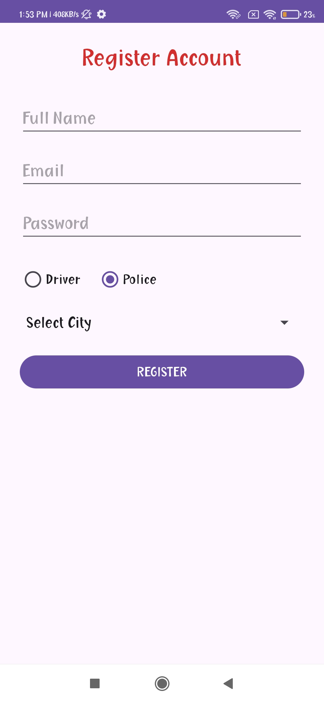
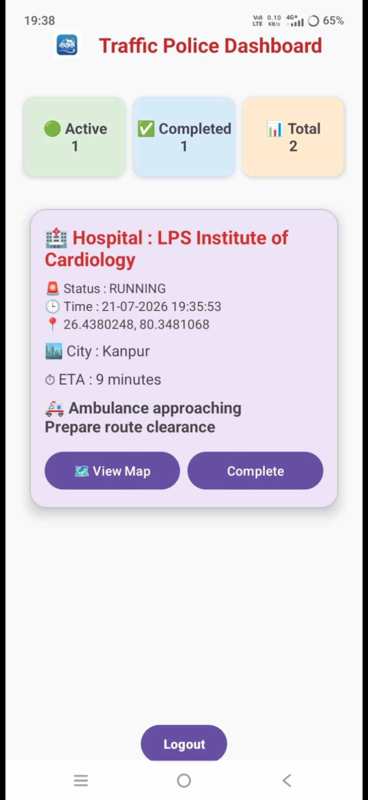
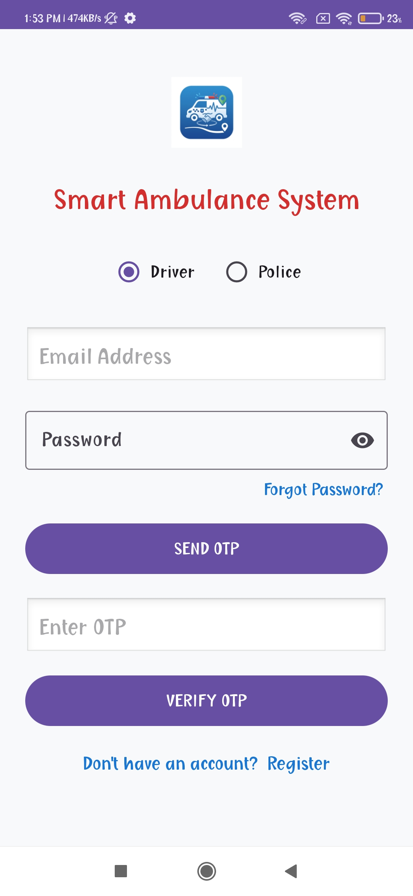
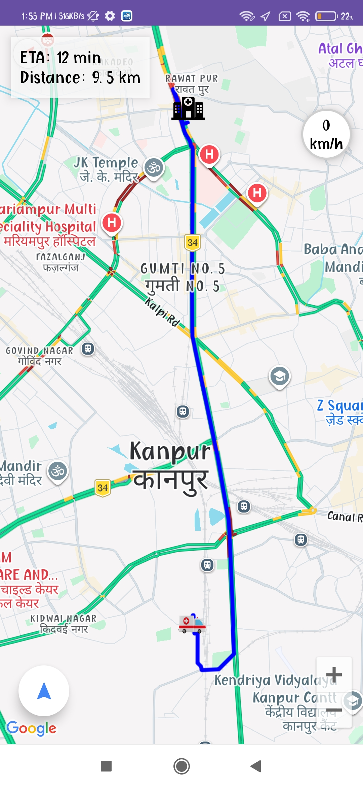
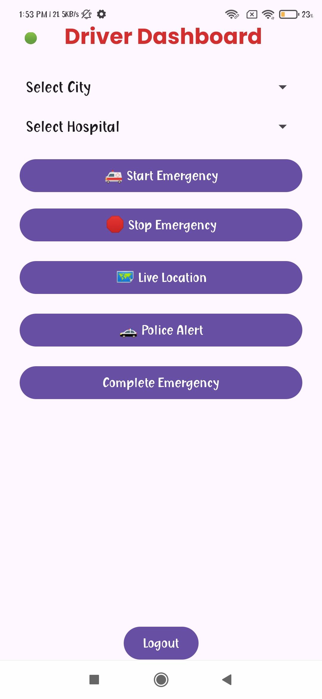
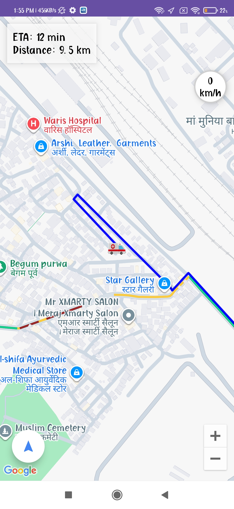

# Smart Ambulance System 🚑

A real-time Android application designed to help ambulances reach hospitals faster by providing live location tracking, route navigation, emergency alerts, and coordination between ambulance drivers and police.

## Features

- 🚑 Ambulance driver emergency mode
- 📍 Real-time ambulance location tracking
- 🗺️ Google Maps integration
- 🛣️ Road-based route navigation
- 🔄 Automatic route recalculation when the ambulance goes off-route
- 🚔 Police emergency alerts
- 🏥 Multiple hospital locations
- 📡 Live ambulance speed updates
- 🔐 Email OTP authentication
- 🌐 Firebase real-time data synchronization
- 📱 Android application

## Technologies Used

- Java
- Android Studio
- Google Maps SDK
- OpenRouteService
- Firebase Authentication
- Firebase Realtime Database
- Retrofit
- OkHttp
- Volley
- Gradle

## Project Architecture

The application contains separate flows for:

- Ambulance Driver
- Police

The ambulance driver can start an emergency, select a hospital, view the route, and share live location information. Police users can receive emergency information and assist the ambulance during its journey.

## Security

API keys and private configuration files are **not included in this repository**.

The following files are kept local:

- `gradle.properties`
- `google-services.json`

You must provide your own API credentials when configuring the project locally.

## Setup

1. Clone the repository.
2. Open the project in Android Studio.
3. Add your local API keys to `gradle.properties`.
4. Add your Firebase `google-services.json` file inside the `app` folder.
5. Sync Gradle.
6. Build and run the application on an Android device or emulator.

## Future Improvements

- Emergency vehicle priority optimization
- Advanced traffic-aware routing
- Push notifications
- Improved police coordination
- Production deployment

## Author

**Ahmad Khan**

GitHub: [Ahmad2k04](https://github.com/Ahmad2k04)

## 📸 Screenshots

